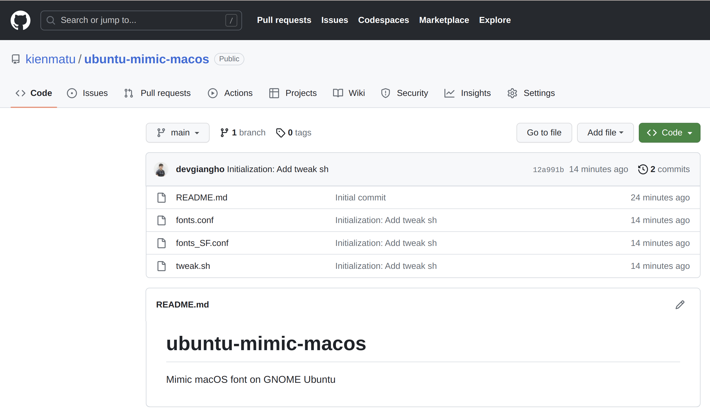
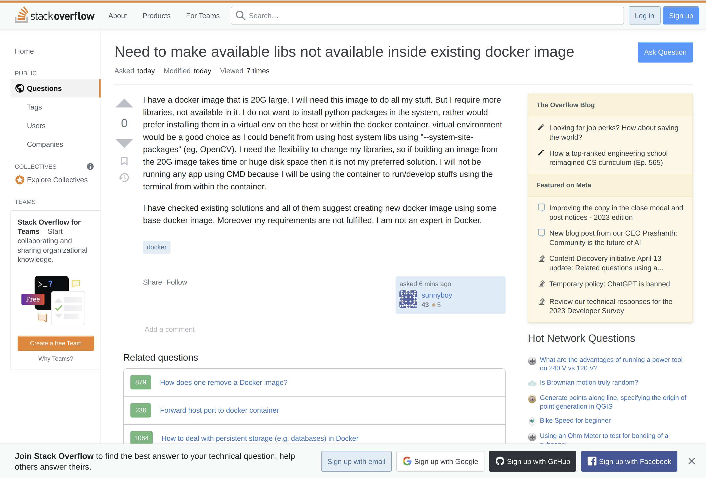
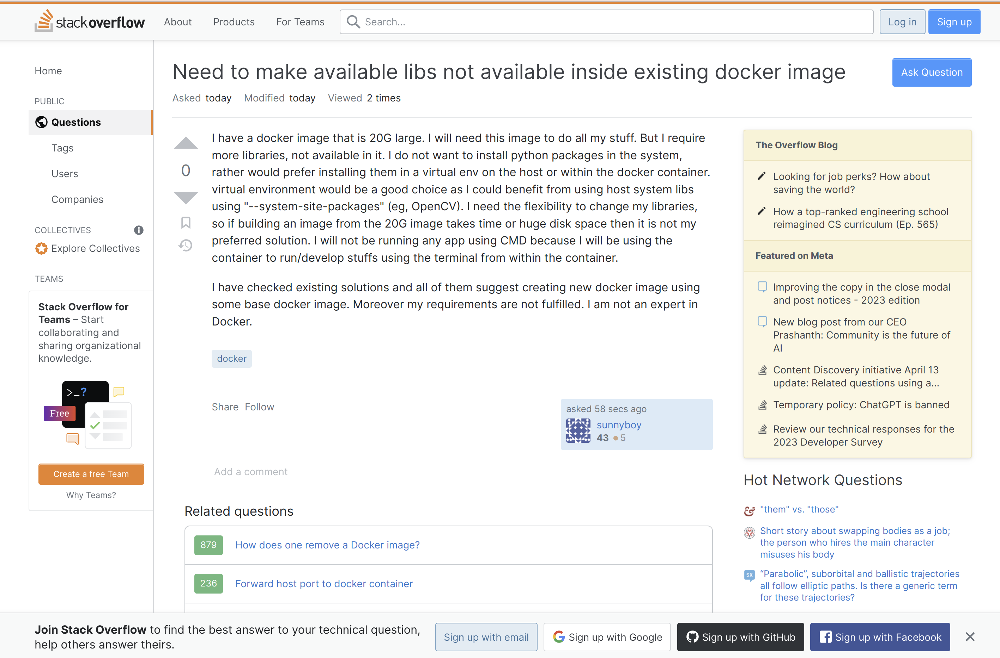

# ubuntu-mimic-macos
Mimic macOS font on GNOME Ubuntu

## Introduction
I want to bring the smooth font on macOS into Ubuntu GNOME.

So I chose the font `Inter`, it is the font used on Figma and ElementaryOS, and it is open-source.

You can also have a choice to change the font into `SF Pro` to have exactly what runs on mac.

I also turned on the STEM darkening, that makes the font "bolder, thicker" like mac, but it doesn't work for HiDPI screen which has a big resolution like 4K.

I also use the font alias to trigger `-apple-system`, `Arial` font on almost websites to have a smooth UX thorough all the machine.

## Instructions

## Screenshots
### Before:
Github:

Stackoverflow:

Google:

### After
Github:

Stackoverflow:

Google:
